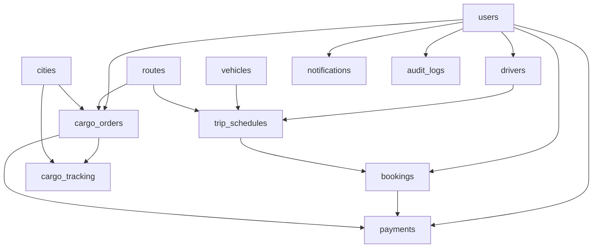

# Digital Transport DB Expansion Plan

## Current State (Backend)
You currently expose CRUD around only three entities:
- [`backend/src/controllers/cityController.js`](backend/src/controllers/cityController.js)
- [`backend/src/controllers/vehicleController.js`](backend/src/controllers/vehicleController.js)
- [`backend/src/controllers/routesController.js`](backend/src/controllers/routesController.js)

So core booking flow tables are still missing (users, trips/schedules, bookings, cargo orders, payments, and status history).

## Target DB Tables to Add (MVP)
Add these tables on MySQL (`transport` DB) while keeping your existing `cities`, `vehicles`, `routes`:

1. **`users`**
- Purpose: single auth/profile table for Customer/Driver/Admin
- Key fields: `user_id`, `full_name`, `email` (unique), `phone` (unique), `password_hash`, `role` (`customer|driver|admin`), `is_active`, timestamps

2. **`drivers`**
- Purpose: driver-specific data separate from generic user
- Key fields: `driver_id`, `user_id` (FK users), `license_number` (unique), `license_expiry`, `status`

3. **`vehicle_assignments`**
- Purpose: bind drivers to vehicles over time
- Key fields: `assignment_id`, `vehicle_id` (FK vehicles), `driver_id` (FK drivers), `start_date`, `end_date`, `is_current`

4. **`trip_schedules`**
- Purpose: concrete departures/availability on a route
- Key fields: `trip_id`, `route_id` (FK routes), `vehicle_id` (FK vehicles), `driver_id` (FK drivers), `departure_time`, `arrival_time`, `seat_capacity`, `available_seats`, `status`, `base_fare`

5. **`bookings`** (Passenger)
- Purpose: passenger reservation records
- Key fields: `booking_id`, `customer_id` (FK users), `trip_id` (FK trip_schedules), `seat_count`, `total_price`, `booking_status`, `payment_status`, `booked_at`

6. **`cargo_orders`**
- Purpose: cargo shipment requests
- Key fields: `cargo_id`, `customer_id` (FK users), `route_id` (FK routes), `pickup_city_id`, `dropoff_city_id` (FK cities), `cargo_type`, `weight_kg`, `volume_m3`, `declared_value`, `special_handling`, `status`, `requested_pickup_date`

7. **`cargo_tracking`**
- Purpose: timeline/status updates for cargo
- Key fields: `tracking_id`, `cargo_id` (FK cargo_orders), `status`, `location_city_id` (FK cities), `note`, `updated_by` (FK users), `updated_at`

8. **`payments`**
- Purpose: unified payment records for both bookings and cargo
- Key fields: `payment_id`, `customer_id` (FK users), `booking_id` (nullable FK bookings), `cargo_id` (nullable FK cargo_orders), `amount`, `currency`, `method`, `provider_txn_ref`, `status`, `paid_at`
- Constraint: exactly one of (`booking_id`, `cargo_id`) should be set per row

9. **`notifications`**
- Purpose: app/web alerts for booking/cargo/payment events
- Key fields: `notification_id`, `user_id` (FK users), `title`, `body`, `type`, `is_read`, `created_at`

10. **`audit_logs`**
- Purpose: admin/security traceability
- Key fields: `log_id`, `actor_user_id` (FK users), `action`, `entity_type`, `entity_id`, `meta_json`, `created_at`

## Relationship Map

## Implementation Steps in Backend
- Create migration SQL file (e.g., [`backend/src/db/migrations/001_core_transport_schema.sql`](backend/src/db/migrations/001_core_transport_schema.sql)) with:
  - table creation order based on FK dependencies
  - indexes for `email`, `phone`, `route_id`, `trip_id`, `status`, timestamps
  - CHECK/ENUM validations where supported
- Add optional seed SQL (e.g., admin user + sample trip schedule) in [`backend/src/db/seeds/001_seed_core_data.sql`](backend/src/db/seeds/001_seed_core_data.sql)
- Update controllers/routes incrementally after schema creation:
  - start with `users`, `trip_schedules`, `bookings`, `cargo_orders`, `payments`
  - keep existing city/vehicle/route endpoints compatible

## Validation and Data Integrity Rules
- Enforce FK constraints everywhere (no orphan bookings/cargo/tracking rows)
- Use unique constraints for identifiers (`email`, `phone`, `license_number`, optional `provider_txn_ref`)
- For `trip_schedules`, prevent `available_seats > seat_capacity`
- For `bookings`, transactionally decrement `available_seats` to avoid race conditions
- For `payments`, enforce one target only: booking XOR cargo

## Delivery Order (Recommended)
1. Auth and roles: `users`, `drivers`
2. Operations: `trip_schedules`, `bookings`, `cargo_orders`
3. Financial: `payments`
4. Visibility & governance: `cargo_tracking`, `notifications`, `audit_logs`

This gives you an MVP that supports both passenger booking and cargo workflows for regional mobility with proper operational and payment backbone.